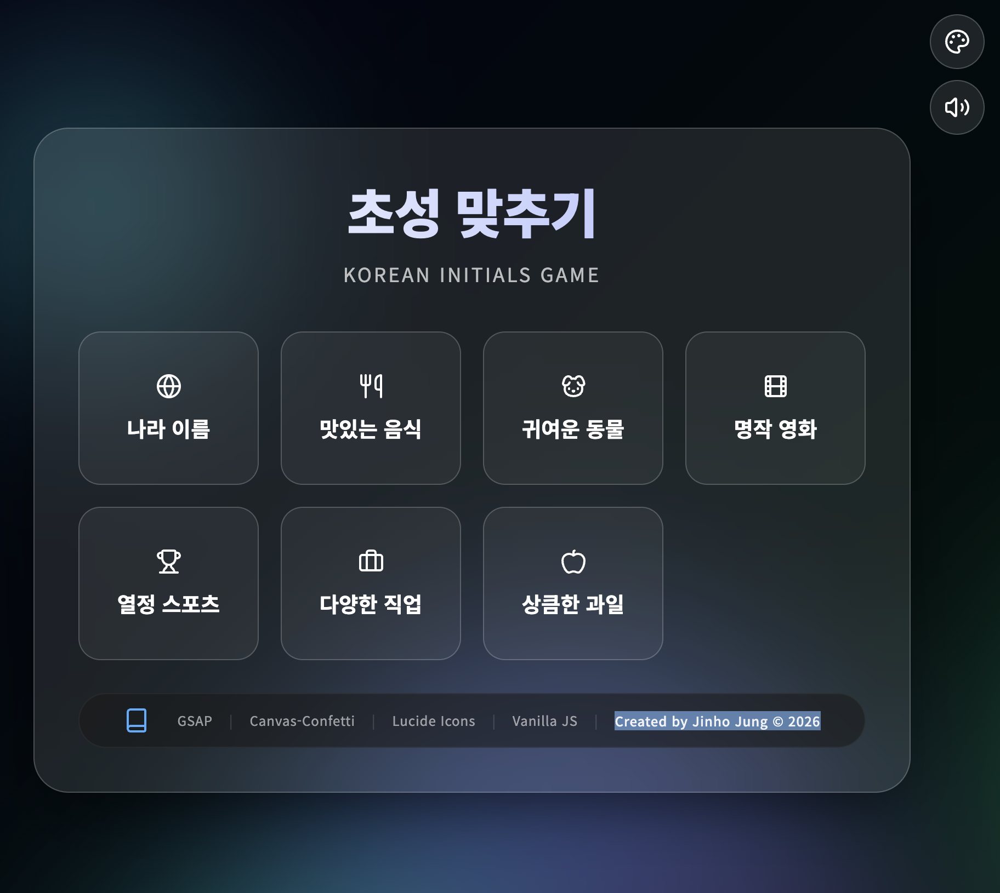
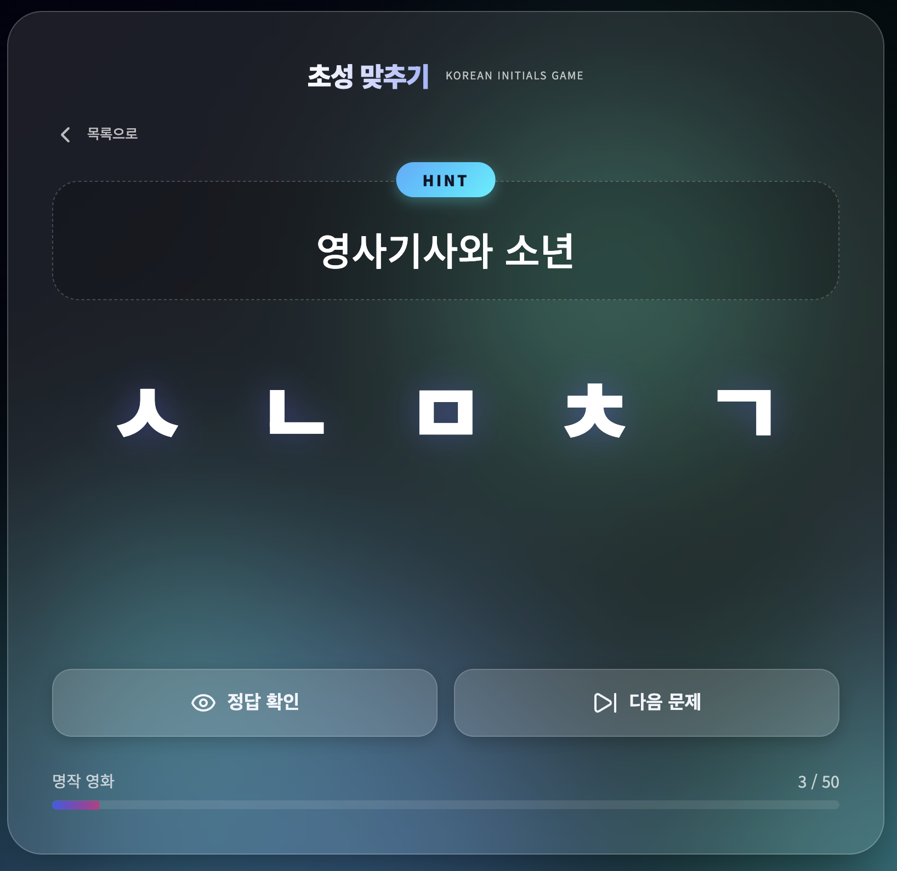
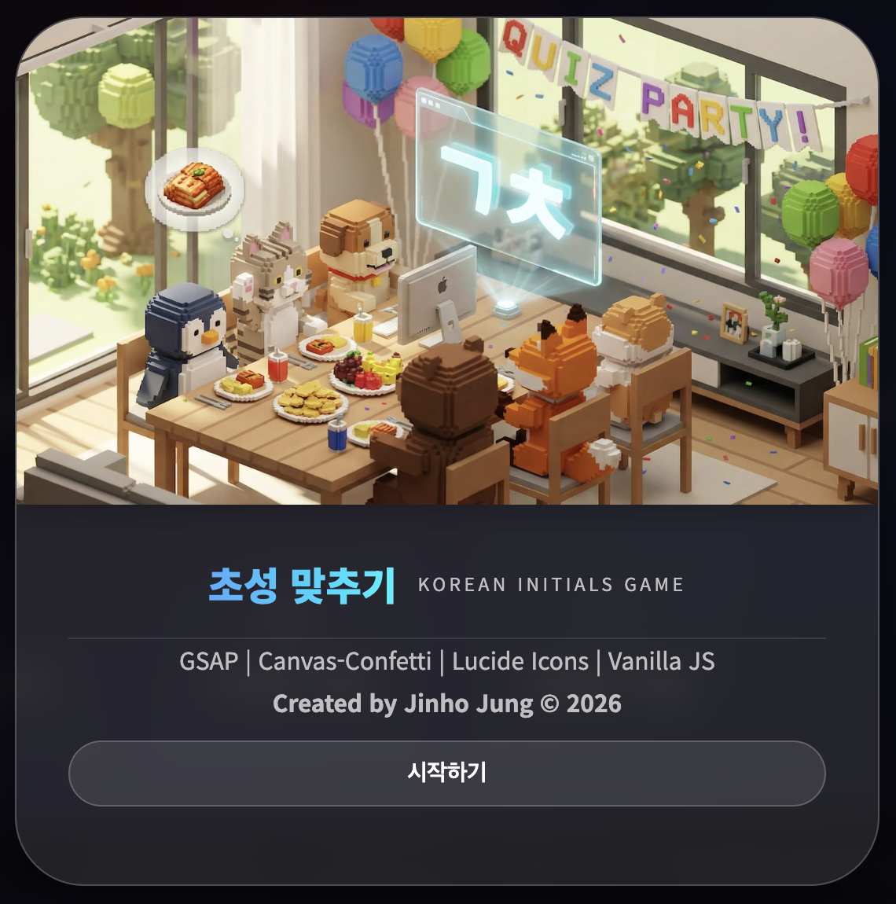

# 한글 초성 맞추기 (Korean Initials Game)

한글 초성을 보고 정답을 맞추는 인터랙티브 웹 게임입니다.

**🎮 [Live Demo](https://jvibeschool.org/KRINIT/)**

## 📸 스크린샷

<div align="center">
  
  
</div>

<div align="center">
  
  
</div>

## 🎮 게임 소개

**초성 맞추기**는 한글의 초성(자음)만 보고 단어를 맞추는 두뇌 게임입니다. 7개의 카테고리(나라, 음식, 동물, 영화, 스포츠, 직업, 과일)에서 다양한 문제를 풀 수 있습니다.

### 주요 기능

- 🎯 **7개 카테고리**: 나라, 음식, 동물, 영화, 스포츠, 직업, 과일
- 🎨 **3가지 테마**: Default, Arctic Aurora, Neon Midnight
- 🎵 **배경음악 & 효과음**: 게임 진행에 맞는 사운드 제공
- 🎊 **화려한 애니메이션**: GSAP 기반의 부드러운 전환 효과
- 📱 **반응형 디자인**: 모바일, 태블릿, 데스크톱 모두 지원
- 🌐 **로컬 실행 가능**: 서버 없이 브라우저에서 바로 실행
- ℹ️ **스플래시 모달**: 게임 정보와 기술 스택을 확인할 수 있는 인터랙티브 모달

## 🚀 시작하기

### 설치 및 실행

1. 저장소 클론 또는 다운로드
```bash
git clone [repository-url]
cd 44.\ 한글초성\ 게임
```

2. 브라우저에서 `index.html` 파일 열기
   - 파일 탐색기에서 `index.html`을 더블클릭하거나
   - 브라우저 주소창에 파일 경로를 직접 입력

### 파일 구조

```
44. 한글초성 게임/
├── index.html          # 메인 게임 파일
├── words.js            # 게임 데이터 (단어 및 힌트)
├── splash.jpg          # 스플래시 이미지
├── dev_guide.md        # 개발 가이드
├── README.md           # 프로젝트 문서
├── public/
│   └── MP3/           # 사운드 파일
│       ├── yes.mp3
│       ├── no.mp3
│       ├── congrat.mp3
│       └── bgm1-5.mp3
└── screenshot/        # 스크린샷 폴더
```

## 🎯 게임 방법

1. **카테고리 선택**: 메인 화면에서 원하는 카테고리를 클릭
2. **초성 확인**: 화면에 표시된 초성과 힌트를 확인
3. **정답 확인**: "정답 확인" 버튼을 눌러 답을 확인
4. **다음 문제**: "다음 문제" 버튼으로 계속 진행
5. **테마 변경**: 우측 상단의 팔레트 아이콘으로 배경 테마 변경
6. **사운드 조절**: 우측 상단의 스피커 아이콘으로 음향 ON/OFF
7. **정보 확인**: 푸터의 책 아이콘을 클릭하여 게임 정보 모달 열기

## 🛠 기술 스택

- **HTML5**: 구조 및 마크업
- **CSS3**: 스타일링 및 애니메이션
- **Vanilla JavaScript**: 게임 로직 및 인터랙션
- **[GSAP](https://gsap.com/)**: 고급 애니메이션 라이브러리
- **[Canvas-Confetti](https://github.com/catdad/canvas-confetti)**: 축하 효과
- **[Lucide Icons](https://lucide.dev/)**: 아이콘 세트

## 🎨 디자인 특징

- **글래스모피즘(Glassmorphism)**: 반투명 유리 질감의 현대적 UI
- **동적 메쉬 배경**: 움직이는 그라데이션 배경 효과
- **마이크로 애니메이션**: 사용자 인터랙션에 반응하는 세밀한 애니메이션
- **말풍선 스타일 정답 표시**: 정답이 부유하는 말풍선 형태로 표시
- **반응형 레이아웃**: 모든 화면 크기에 최적화
- **미니 헤더**: 게임 진행 중 제목이 작아지고 한 줄로 표시
- **인터랙티브 푸터**: 기술 스택 링크와 정보 모달 제공

## 📝 데이터 구조

게임 데이터는 `words.js` 파일에 다음과 같은 형식으로 저장됩니다:

```javascript
const wordData = {
  "나라": [
    { "word": "대한민국", "hint": "우리나라" },
    { "word": "미국", "hint": "자유의 여신상" }
  ],
  "음식": [
    { "word": "김치", "hint": "한국의 대표 발효 음식" }
  ]
  // ... 더 많은 카테고리
};
```

## 🎵 사운드

게임에는 다음과 같은 사운드가 포함되어 있습니다:

- `yes.mp3`: 카테고리 선택 시
- `congrat.mp3`: 정답 확인 시
- `bgm1-5.mp3`: 랜덤 배경음악 (게임 진행 중)

모든 사운드는 `./public/MP3/` 폴더에 상대 경로로 저장되어 있어 프로젝트 이동 시에도 정상 작동합니다.

## 🌈 테마

세 가지 배경 테마를 제공합니다:

1. **Default**: 보라색-네이비 그라데이션
2. **Arctic Aurora**: 에메랄드-블루 오로라 느낌
3. **Neon Midnight**: 네온 컬러의 사이버펑크 스타일

우측 상단의 팔레트 아이콘을 클릭하여 테마를 순환할 수 있습니다.

## ✨ 주요 UI 요소

### 스플래시 모달
- 푸터의 책 아이콘 클릭 시 표시
- 게임 로고 이미지 (60% 높이)
- 게임 제목 및 설명 (40% 높이)
- 기술 스택 링크 (클릭 가능)
- 제작자 이메일 링크

### 정답 표시
- 말풍선 스타일의 박스
- 위쪽을 가리키는 V자 꼬리
- 통통 튀는 등장 애니메이션
- 부유하는 효과 (Floating)
- 밝은 사이언 색상 텍스트

### 힌트 박스
- 상단에 "HINT" 뱃지
- 한 줄 레이아웃
- 큰 글꼴 크기 (2.2rem)
- 텍스트 오버플로우 시 말줄임표

## 📄 라이선스

이 프로젝트는 교육 목적으로 제작되었습니다.

## 👤 제작자

**Jinho Jung**  
📧 [jvisualschool@gmail.com](mailto:jvisualschool@gmail.com)  
© 2026

---

**즐거운 게임 되세요! 🎮✨**
